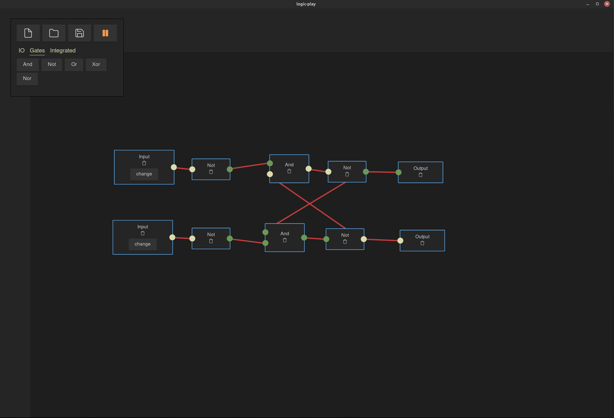

# Logic Gate Playground


This is an example of an app developed with svelte. It is a logic gate playground IDE. A user can add gates, connect them and simulate with inputs their behaviour. The editor is draggable, pannable and zoomable. Documents can be saved and loaded again.

## Features

- [x] SR latch
- [x] RS latch
- [ ] clock
- [x] And, Not
- [x] Or, Xor, Nor
- [ ] comment node
- [x] file save and load
- [x] simulation of changing inputs

## Live Demo

you can try logic-play online

https://xdb.ovh/logic-play/

## Development

logic-play is built with tauri & Svelte and TypeScript with `"noImplicitAny": true`

Prerequisites: https://tauri.app/v1/guides/getting-started/prerequisites

``` 
npm install
npm run tauri dev
 ```